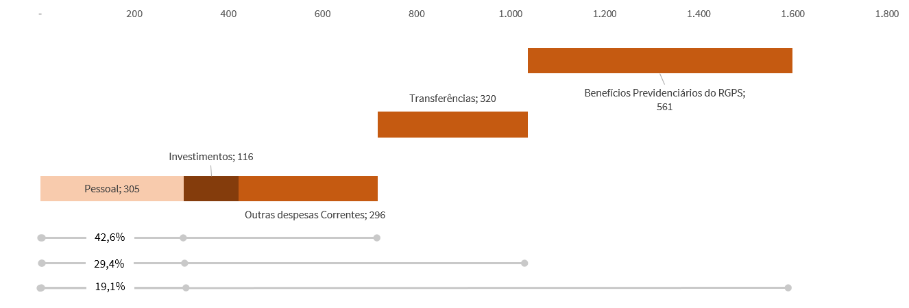

---
output:
  html_document:
    code_folding: hide
    highlight: zenburn

---

```{css, echo=FALSE}
* {
  font-family: "Open Sans";
}

.dygraph-legend, .dygraph-axis-label {
  font-family: "Open Sans";
}

.dygraph-label {
  font-family: "Open Sans";
}

h1, h2, h3, h4, h5 {
  color: #1E4C7A;
}

blockquote {
  font-size: 12px;
  background-color: #F0F5F7;
}

.d3tree3 text {
  font-family: "Open Sans";
}

.temporario {
  font-size: 12px;
  background-color: #f9ec95;
  padding: 5px 10px;
  border: 2px solid #F8AC08;
}

.destaque {
  background-color: #f9172e;
  color: white;
  padding: 0 5px;
  border-radius: 5px;
}

.wrapperFig {
  border: 1px solid #dddddd;
}

```


```{r message=FALSE, warning=FALSE}
library(readxl)
library(tidyverse)
library(extrafont)
library(RColorBrewer)
library(treemap)
library(d3Tree)

# devtools::install_github("gluc/data.tree")
# devtools::install_github("timelyportfolio/d3treeR")

library(d3treeR)

#font_import()

loadfonts()

tres_cores <-c("#F8AC08","#028063","#6E287C")
tres_cores_pasteis <- c("#FECE60","#63BEAF", "#BE8EBF")

cor_ativo <- "#1E466A"
cor_passivo <- "#CA4017"

tema_BSPN <- function(){
    theme_minimal() +
    theme(
      text = element_text(family = "Calibri", colour = "grey20"),
      axis.text = element_text(family = "Calibri", colour = "grey20"),
      title = element_text(face = "bold", size = 10),
      plot.subtitle = element_text(face = "plain", family = "Calibri Light", size = 10),
      plot.caption = element_text(face = "italic"),
      panel.grid.major = element_blank(), 
      panel.grid.minor = element_blank(),
      legend.text = element_text(size = 8),
      legend.title = element_text(size = 8),
      axis.ticks.x = element_line(),
      legend.position = 'bottom')
}

```

O Balanço do Setor Público Nacional (BSPN) é uma publicação anual que apresenta as contas consolidadas da Federação Brasileira. Engloba as contas dos poderes Executivo, Legislativo e Judiciário, incluindo também o Ministério Público e a Defensoria Pública, e contempla as esferas Federal, Estadual, Distrital e Municipal.

Nesta página, destacaremos alguns dos principais dados apresentados no BSPN de 2017 (que pode ser lido em sua versão completa, com todas as suas notas explicativas, [aqui](http://www.tesouro.fazenda.gov.br/documents/10180/665291/CPU_BSPN_2017-v2_Diagramado)).

## O balanço patrimonial

O balanço patrimonial evidencia a situação patrominial da entidade pública, elencando seus **ativos** (bens e direitos) e seus **passivos** (obrigações). Quando o ativo é maior do que o passivo, temos um *patrimônio líquido*. No entanto, quando o passivo supera o ativo, temos uma situação de *passivo a descoberto*.

O gráfico a seguir resume o Balanço Patrimonial, demonstrando os valores dos ativos e passivos para a Federação ("consolidado"), para a União, para o conjunto dos Estados e para o conjunto dos Municípios. As ocorrências de patrimônio líquido ou passivo a descoberto estão indicadas no gráfico. 

```{r message=FALSE, warning=FALSE}

# le os dados. é usado no sankey, mas serve para montarmos nosso gráfico geral do BP.

ativo <- read.csv2("links-ativo.csv")
ativo$valor <- as.numeric(gsub("[.]", "", ativo$valor))

passivo <- read.csv2("links-passivo.csv")
passivo$valor <- as.numeric(gsub("[.]", "", passivo$valor))

at <- ativo %>%
  filter(up == "Ativo") %>%
  group_by(up, ente) %>%
  summarise(valor = sum(valor)) %>%
  spread(key = "ente", value = "valor") %>%
  mutate(Consolidado = sum(.[2:4])) %>%
  gather(2:5, key = "ente", value = "valor")

pa <- passivo %>%
  filter(up == "Passivo") %>%
  group_by(up, ente) %>%
  summarise(valor = sum(valor)) %>%
  spread(key = "ente", value = "valor") %>%
  mutate(Consolidado = sum(.[2:4])) %>%
  gather(2:5, key = "ente", value = "valor")

# juntando ativo e passivo
  
bp <- at %>% 
  rbind(pa) %>%
  rename(Classe = up)

# para montar os gráficos do jeito que quero, preciso de uma tabela assim:

# class     | Ativo | Passivo
# ----------+-------+--------
# normal    | Ativo | Passivo
# PaD       | v_PaD |    0
# PL        |   0   |  v_PL
# ----------+-------+--------

bp_formatado <- bp %>%
  spread(key = "Classe", value = "valor") %>%
  mutate(PaD = ifelse(Passivo > Ativo, Passivo - Ativo, 0),
         PL  = ifelse(Ativo > Passivo, Ativo - Passivo, 0),
         normal = 0) %>%
  gather(PaD, PL, normal, key = "agrup", value = "valor") %>%
  mutate(
    Ativo = case_when(
      agrup == "normal" ~ Ativo,
      agrup == "PaD" ~ valor,
      agrup == "PL" ~ 0),
    Passivo = case_when(
      agrup == "normal" ~ Passivo,
      agrup == "PaD" ~ 0,
      agrup == "PL" ~ valor)) %>%
  select(-valor) %>%
  gather(Passivo, Ativo, key = "Classe", value = "valor") %>%
  mutate(valor = round(valor/1000,2),
         agrup = factor(agrup, levels = c("PaD", "PL", "normal")),
         Classe = factor(Classe, levels = c("Passivo", "Ativo")),
         ente = factor(ente, levels = c("Consolidado", "União", "Estados", "Municípios"))) # só para a ordem sair direito nos gráficos
  
                  
ggplot(bp_formatado, aes(fill = agrup, y = valor, x = factor(Classe))) +
  coord_flip() +
  geom_bar( stat="identity", width=0.6, color = "white", size = 1) + # p/ transformar em %, position="fill"
  geom_text(aes(label= ifelse(valor == 0, "", format(round(valor,0), big.mark = ".", decimal.mark = ","))),
                size = 3, 
                position = position_stack(vjust = 0.5), 
                hjust = 0.5, 
                family = "Open Sans", 
                color = "white") +
  scale_y_continuous(labels=function(x) {format(x, big.mark = ".", decimal.mark=",", scientific = FALSE)}) +
  scale_fill_discrete(labels = c(
    "normal" = "Ativo e Passivo",
    "PaD" = "Passivo a Descoberto",
    "PL" = "Patrimônio Líquido"))+
  labs(
    x = NULL,
    y = NULL,
    fill = "Grupos de valores",
    title = "Resumo do Balanço Patrimonial do BSPN 2017",
    subtitle = "Valores em R$ bilhões.",
    caption = "Fonte: BSPN 2017, Quadros 2 e 3 - \"Balanço Patrimonial – Ativo e Passivo (Consolidado Nacional e por esfera de governo)\"") +
  facet_grid(ente ~ .) + tema_BSPN()

```

A consolidação das contas públicas passa por um momento de transição. Parte do reconhecimento dos bens, direitos e obrigações ainda não é obrigatória. Os prazos-limite para a implantação dos procedimentos contábeis patrimoniais foram estabelecidos pela [Portaria STN nº 548, de 24 de setembro de 2015](http://www.tesouro.fazenda.gov.br/documents/10180/653221/Item+1+-+Portaria+548-2015+-+PIPCP.pdf), e variam de 2015 a 2025.

Como mencionado anteriormente, o Patrimônio Líquido é o valor residual dos ativos dos entes públicos depois de deduzidos todos seus passivos. O saldo negativo é denominado Passivo a Descoberto. Inclui também o resultado do período e os ajustes da exclusão de saldos de transações recíprocas entre os entes da Federação.

Alinhando-se aos países que apresentam as melhores práticas em contabilidade pública - como o Reino Unido, Estados Unidos, Austrália e Canadá - a inversão do Patrimônio Líquido no BSPN reflete a principal atividade das entidades públicas: a prestação de serviços públicos à população (*service oriented*), ao contrário do que seria esperado em uma empresa, a qual visa principalmente o lucro (*profit oriented*). É natural que os Governos apresentem esse panorama contábil quando assumem compromissos que visem à sustentabilidade de políticas públicas, cuja capacidade para cumpri-los depende dos tributos e das contribuições a serem
arrecadados no futuro.

### Os ativos

O Quadro 2 do BSPN, "Balanço Patrimonial – Ativo (Consolidado Nacional e por esfera de governo)", demonstra a composição do ativo em seus diversos componentes, conforme a hierarquia estabelecida no Plano de Contas Aplicado ao Setor Público.

Para demonstrar tanto essa hierarquia quanto a participação de cada grupo de entidades públicas (União, Estados e Municípios) nos valores consolidados, apresentamos o diagrama interativo abaixo. Os nós podem ser movimentados à vontade, e os valores podem ser visualizados posicionando-se o mouse sobre o elemento desejado.

As cores dos ramos entre os níveis dos ativos representam os valores dos <span style="color: white; background-color: #f8ac08; letter-spacing: 0.1em;">municípios</span>, <span style="color: white; background-color: #028063; letter-spacing: 0.1em; color: white;">estados</span> e <span style="color: white; background-color: #6e287c; letter-spacing: 0.1em; color: white;">união</span>.

```{r message=FALSE, warning=FALSE}
library(plotly)

# cores

mtx_tres_cores <- col2rgb(tres_cores_pasteis)

cores <- NULL
for (i in 1:dim(mtx_tres_cores)[2] ) {
  cores <- c(cores, paste("rgba(", mtx_tres_cores[1,i],", ",  mtx_tres_cores[2,i],", ",  mtx_tres_cores[3,i],", 0.8)", sep = ""))
}

tbl_cores <- data.frame("ente" = levels(ativo$ente),cores)

# funcao de plotagem

plota_sankey <- function(dados, rotulos, cor_nos){
  plot_ly(
    type = "sankey",
    orientation = "h",
    opacity = 0.6,
    width = 800,
    height = 600,
    textfont = list(
      family = "Open Sans",
      color = "#444444",
      size = 12),
    
    node = list(
      label = rotulos,
      color = cor_nos, ##004a93
      pad = 10,
      thickness = 25,
      line = list(
        color = cor_nos,
        width = 0)),
    
    hoverlabel = list(
      font = list(
        family = "Open Sans")),
    
    link = list(
      source = dados$src,
      target = dados$trg,
      value =  dados$valor,
      color =  dados$cores)) %>% 
  
    layout(
      title = "",
      font = list(
        family = "Open Sans",
        size = 11,
        color = "#004a93"))
}

# funcao para processar os dados e chamar a função de plotagem

##### incluir argumento na função para cor dos nós!

plota_ente <- function(ente_in, dados, cor_nos){
  
  if (ente_in == "Consolidado") {
    dados_ente <- dados}
    else {dado_ente <- dados %>% filter(ente == ente_in)
  }
  
  lista_nos <- unique(c(levels(dados_ente$up), levels(dados_ente$down)))
  numeros_nos <- 0:(length(lista_nos)-1)
  nos <- data.frame(lista_nos, numeros_nos)
  
  matriz <- dados_ente %>%
    left_join(nos, by = c("up" = "lista_nos")) %>%
    rename(src = numeros_nos) %>%
    left_join(nos, by = c("down" = "lista_nos")) %>%
    rename(trg = numeros_nos)
  
  matriz <- matriz %>%
    left_join(tbl_cores)
  
  plota_sankey(matriz, lista_nos, cor_nos)
  #return(matriz)
}

#dados_consolidado <- gera_dados_ente("Consolidado")
#dados_Uniao <- gera_dados_ente("União")
#dados_Estados <- gera_dados_ente("Estados")
#dados_Municipios <- gera_dados_ente("Municípios")

plota_ente("Consolidado", ativo, cor_ativo)

```

### Os passivos

O diagrama abaixo demonstra, de forma equivalente, as informações do Passivo, conforme o Quadro 3, "Balanço Patrimonial – Passivo (Consolidado Nacional e por esfera de governo)", do BSPN.

Mais uma vez, as cores dos ramos entre os níveis dos ativos representam os valores dos <span style="color: white; background-color: #f8ac08; letter-spacing: 0.1em;">municípios</span>, <span style="color: white; background-color: #028063; letter-spacing: 0.1em; color: white;">estados</span> e <span style="color: white; background-color: #6e287c; letter-spacing: 0.1em; color: white;">união</span>.

```{r, echo=FALSE, message=FALSE, warning=FALSE}
plota_ente("Consolidado", passivo, cor_passivo)
```

## Informações Orçamentárias

O BSPN também contempla informações orçamentárias dos entes da Federação, apresentando o demonstrativo da execução orçamentária, com as receitas e despesas executadas, e o demonstrativo das despesas por função.

### Receitas e Despesas

Como informado na Nota Explicativa nº 4, "Escopo", da íntegra do Balanço do Setor Público Nacional:

<blockquote>

O Demonstrativo da Execução Orçamentária apresenta as receitas e despesas executadas conforme disposto no art. 35 da Lei nº 4.320, de 17 de março de 1964. Desse modo, nele são apresentadas as receitas arrecadadas e as despesas empenhadas no exercício de 2017. 

As linhas de desdobramento das receitas e das despesas seguem as classificações orçamentárias dispostas na Portaria Interministerial STN/SOF nº 163, de 4 de maio de 2001, adaptadas à estrutura da DCA.

Assim, as receitas são evidenciadas por categoria econômica, origem e espécie e as despesas por categoria econômica e grupo de natureza.

</blockquote>

O gráfico a seguir busca resumir as informações dos Quadros 8 e 9 do BSPN, que apresentam as receitas e despesas orçamentárias do exercício de 2017, considerando a receitas _arrecadadas_ e as despesas _empenhadas_.

```{r message=FALSE, warning=FALSE}

recDesp <- read_excel("RecDesp2017.xlsx")

recDesp_formatado <- recDesp %>%
  filter(!(Classificador %in% c("Superávit", "Déficit"))) %>%
  gather(5:8, key = "Ente", value = "Valor") %>%
  group_by(Classe, Ente, Classificador) %>%
  summarise(Valor = sum(Valor)) %>%
  ungroup %>%
  mutate(Classe = factor(Classe),
         Ente = factor(Ente),
         Ente = fct_recode(Ente, "Consolidado" = "CONSOLIDADO", "União" = "UNIÃO", "Estados" = "ESTADOS", "Municípios" = "MUNICÍPIOS"),
         Ente = fct_relevel(Ente, "União", after = 1),
         Classificador = factor(Classificador),
         Classificador = fct_relevel(Classificador, "Dívida", "Operações de Crédito", "Investimentos", "Transferências", "Outras despesas correntes", "Outras Receitas", "Pessoal", "Tributos", after = 0),
         Valor = Valor/1000)

recDesp_filtrado <- recDesp_formatado %>%
  filter(Valor > 20)

# como empurrar esses labels?

cores_rec_desp <- brewer.pal(8, "Spectral")
cores_legenda <- c("Dívida" = cores_rec_desp[1], 
                 "Operações de Crédito" = cores_rec_desp[8], 
                 "Investimentos" = cores_rec_desp[2], 
                 "Transferências"= cores_rec_desp[7], 
                 "Outras despesas correntes" = cores_rec_desp[3], 
                 "Outras Receitas" = cores_rec_desp[6], 
                 "Pessoal" = cores_rec_desp[4], 
                 "Tributos" = cores_rec_desp[5])

ggplot(recDesp_filtrado, aes(fill = Classificador, y = Valor, x = Ente)) +
  coord_flip() +
  geom_bar(stat="identity", width=0.6, color = "white", size = 1) + 
  geom_text(aes(label= ifelse(Valor == 0, "", format(round(Valor,0), big.mark = ".", decimal.mark = ",")),
                vjust = ifelse(Classe == "Despesas" & Ente == "Estados" & Classificador == "Investimentos", -2, 0.5)),
                size = 2.5, 
                hjust = 0.5, 
                position = position_stack(vjust = 0.5),
                family = "Open Sans", 
                color = "grey20") +
  geom_text(aes(label = ifelse(Ente != "Consolidado", "", paste0(Classificador)), # sem esse paste, ele mostra a posição do classificador no vetor "Classificador"
                vjust = ifelse(Classificador == "Investimentos", -2.6, 2.6)),
                #color = Classificador), # se fosse colocar os rótulos com as mesmas cores
                size = 2,
                color = "grey20",
                hjust = 0,
                position = position_stack(vjust = 0),
                family = "Open Sans") +
  scale_y_continuous(labels=function(x) {format(x, big.mark = ".", decimal.mark=",", scientific = FALSE)}) +
  scale_fill_manual(values = cores_legenda) +
  # scale_color_manual(values = cores_legenda) + #se fosse colocar os rótulos com as mesmas cores
  labs(
    x = NULL,
    y = NULL,
    fill = "Despesas \n\nReceitas",
    title = "Resumo das Receitas e Despesas do BSPN 2017",
    subtitle = "Valores em R$ bilhões. Categorias com valores inferiores a R$ 20 bilhões não foram apresentados.",
    caption = "Fonte: BSPN 2017, Quadros 9 e 10, \"DEMONSTRATIVO DA EXECUÇÃO ORÇAMENTÁRIA\"") +
  facet_grid(Classe ~ .) + tema_BSPN() #+ guides(color = FALSE) # se fosse colocar rótulos c/ cores

```

O gráfico anterior permite fazer uma comparação entre os valores absolutos de cada conjunto de entes. No entanto, para melhor visualizar e participação de cada tipo de despesa e de receita nos totais, e comparar essas participações entre os entes, podemos apresentar o mesmo gráfico de uma forma diferente, em termos de percentuais dos totais:

```{r message=FALSE, warning=FALSE}

# vamos nos divertir com o dplyr e acrescentar uma coluna com os percentuais por Classe+Ente, para incluir os rótulos no gráfico 

recDesp_filtrado_percent <- recDesp_filtrado %>%
  group_by(Classe, Ente) %>%
  summarise(Total = sum(Valor)) %>%
  right_join(recDesp_filtrado) %>%
  mutate(percentual = Valor/Total) %>%
  select(-Total)

plota_percent <- function(dados, titulo){
  ggplot(dados, aes(fill = Classificador, y = Valor, x = Ente)) +
    coord_flip() +
    geom_bar(stat = "identity", position = "fill", width=0.6, color = "white", size = 1) + 
    geom_text(aes(label = scales::percent(round(percentual,3))),
                  position = position_fill(vjust = 0), 
                  hjust = -0.1, 
                  vjust = -2.4,
                  size = 2.5, 
                  family = "Open Sans", 
                  color = "grey20") +
    scale_y_continuous(labels = scales::percent) +
    scale_fill_manual(values = cores_legenda) +
    # scale_color_manual(values = cores_legenda) + #se fosse colocar os rótulos com as mesmas cores
    labs(
      x = NULL,
      y = NULL,
      fill = "Despesas \n\nReceitas",
      title = titulo,
      subtitle = "Em percentuais do total para cada ente.",
      caption = "Fonte: BSPN 2017, Quadros 9 e 10, \"DEMONSTRATIVO DA EXECUÇÃO ORÇAMENTÁRIA\"") +
    facet_grid(Classe ~ .) + tema_BSPN() #+ guides(color = FALSE) 
  }

plota_percent(recDesp_filtrado_percent %>% filter(Ente != "Consolidado"),"Resumo das Receitas e Despesas do BSPN 2017")


```

Observe que as despesas com "Dívida" e as receitas com "Operações de Crédito" são bastante relevantes na União. Essas receitas e despesas orçamentárias correspondem ao reconhecimento, no orçamento, das operações relacionadas à gestão e ao refinanciamento da Dívida Pública Federal. Se desconsiderarmos essas operações, ficaríamos com o seguinte panorama:

```{r message=FALSE, warning=FALSE}

# recálculo dos percentuais, desconsiderando Dívida e Operações de Crédito

recDesp_filtrado_percent_semDiv <- recDesp_filtrado %>%
  filter(!Classificador %in% c("Operações de Crédito", "Dívida"))

recDesp_filtrado_percent_semDiv <- recDesp_filtrado_percent_semDiv %>%
  group_by(Classe, Ente) %>%
  summarise(Total = sum(Valor)) %>%
  right_join(recDesp_filtrado_percent_semDiv) %>%
  mutate(percentual = Valor/Total) %>%
  select(-Total)

plota_percent(recDesp_filtrado_percent_semDiv %>% filter(Ente != "Consolidado"),"Resumo das Receitas e Despesas do BSPN 2017 \u2013 exceto dívida") + 
  geom_label(aes(x = ifelse(Classe == "Despesas", "União", "Municípios"), 
                 y = ifelse(Classe == "Despesas", 0.6, 0.7),
                 label = ifelse(Classe == "Despesas", "1", "2")),
             color = "white",
             fill = "#f9172e",
             fontface = "bold",
             size = 2.5, 
             family = "Open Sans")
```

Destacamos dois itens do gráfico. Vamos comentá-los no quadro abaixo. 

<div class = "temporario">
O destaque <span class = "destaque">1</span> chama a atenção para a participação do grupo "Outras Despesas Correntes" na União, um percentual de 73,7% das despesas totais, excetuando-se as despesas com a dívida pública federal. Esse percentual é bastante superior ao verificado nos Estados e nos Municípios, que se encontram em torno de 40%.

O que torna esse grupo tão superior na União é o fato de nele se classificarem as despesas com os **benefícios previdenciários do RGPS**, que em 2017 alcançaram o montante de R$ 561,4 bilhões (fonte: Siafi). Com a exclusão dessas despesas, o grupo de Outras Despesas Correntes na União representaria 38,5% das despesas sem dívida, um percentual mais próximo dos demais entes.

Cabe ainda ressaltar que esse grupo na União inclui R$ 320 bilhões (fonte: Siafi) referentes a transferências a Estados e Municípios, incluindo transferências obrigatórias.

O destaque <span class = "destaque">2</span>, por sua vez, ressalta a importância das **transferências** (oriundas de Estados e da União) no total das receitas dos municípios.</div>

Na figura abaixo podemos visualizar os efeitos de "Transferências a Estados e Municípios" e "Benefícios Previdenciários do RGPS" no total das despesas da União.



Uma outra forma de visualizar essas informações é por meio do chamado "tree map". No gráfico das receitas abaixo, a área de cada retângulo é proporcional aos valores que eles representam. Os valores são apresentados primeiramente divididos por cada classificador da **receita**. Observe que as cores das receitas são as mesmas das cores utilizadas no gráfico anterior, para manter coerência.

```{r message=FALSE, warning=FALSE, include=FALSE}

df_cores <- data.frame("Classificador" = names(cores_legenda), "Cor" = unname(cores_legenda))

recTree <- recDesp_filtrado %>%
  filter(Ente != "Consolidado" & Classe == "Receitas") %>%
  left_join(df_cores)

despTree <- recDesp_filtrado %>%
  filter(Ente != "Consolidado" & Classe == "Despesas") %>%
  left_join(df_cores)

grafico_treemap <- function(dados, titulo) {
  treemap(dados, 
        index = c("Classificador", "Ente"), 
        vSize = "Valor", 
        type = "color",
        vColor = "Cor",
        fontfamily.title = "Open Sans",
        fontfamily.labels = "Open Sans",
        fontfamily.legend = "Open Sans",
        fontsize.title = 14,
        fontsize.labels = c(11,8),
        title = titulo)
}

mapaRec <- grafico_treemap(recTree, "Receitas Orçamentárias - 2017")
mapaDesp <- grafico_treemap(despTree, "Despesas Orçamentárias - 2017")

```

É possível clicar nos retângulos para visualizar a distribuição de cada classificador por ente (União, Estados e Municípios). Para retornar à visualização geral, basta clicar no texto "Receitas Orçamentárias Consolidadas - 2017".

```{r message=FALSE, warning=FALSE}
d3tree3(mapaRec, rootname = "Receitas Orçamentárias Consolidadas - 2017")
```

De maneira semelhante, no próximo gráfico os valores são apresentados primeiramente divididos por cada classificador da **despesa**. É possível clicar nos retângulos para visualizar a distribuição de cada classificador por ente (União, Estados e Municípios). Para retornar à visualização geral, basta clicar no texto "Despesas Orçamentárias Consolidadas - 2017".

```{r message=FALSE, warning=FALSE}
d3tree3(mapaDesp, rootname = "Despesas Orçamentárias Consolidadas - 2017")
```

Por fim, é interessante comparar a arrecadação, em 2017, dos diversos impostos atribuídos pela Constituição aos entes da Federação. Cabe lembrar que a Constituição Federal de 1988 distribuiu a competência de instituição dos diversos impostos entre as três esferas de governo:

<blockquote>

Art. 153. Compete à União instituir impostos sobre:

I - **importação** de produtos estrangeiros;

II - **exportação**, para o exterior, de produtos nacionais ou nacionalizados;

III - **renda e proventos** de qualquer natureza;

IV - **produtos industrializados**;

V - **operações de crédito, câmbio e seguro, ou relativas a títulos ou valores mobiliários**;

VI - **propriedade territorial rural**;

[...]

Art. 155. Compete aos Estados e ao Distrito Federal instituir impostos sobre:

I - **transmissão causa mortis e doação**, de quaisquer bens ou direitos;

II - **operações relativas à circulação de mercadorias e sobre prestações de serviços** de transporte interestadual e intermunicipal e de comunicação, ainda que as operações e as prestações se iniciem no exterior;

III - **propriedade de veículos automotores**.

[...]

Art. 156. Compete aos Municípios instituir impostos sobre:

I - **propriedade predial e territorial urbana**;

II - **transmissão "inter vivos"**, a qualquer título, por ato oneroso, de bens imóveis, por natureza ou acessão física, e de direitos reais sobre imóveis, exceto os de garantia, bem como cessão de direitos a sua aquisição;

III - **serviços de qualquer natureza**, não compreendidos no art. 155, II, definidos em lei complementar.
</blockquote>


O gráfico a seguir compara a arrecadação bruta desses diversos impostos em ordem decrescente de valor, destacando o ente responsável por sua instituição:

```{r message=FALSE, warning=FALSE}

# fazer uma rotininha decente para pegar os dados direto do Siconfi, ou pelo menos das planilhas da DCA

impostos <- read.csv2("impostos.csv", dec = ",")

impostos <- impostos %>%
  mutate(Valor = as.numeric(Valor) / 1000000) %>%
  arrange(desc(Valor)) %>%
  mutate(Imposto = fct_reorder(Imposto, Valor, desc = TRUE))

formata_BR <- scales::format_format(big.mark = ".", decimal.mark = ",", scientific = FALSE)

ggplot(impostos, 
      aes(
        fill = Ente, 
        y = Valor, 
        x = Imposto)) +
    coord_flip() +
    geom_bar(stat="identity", width=0.6, color = "white", size = 1) +
    labs(
      x = NULL,
      y = NULL,
      fill = "Ente",
      title = paste("Arrecadação bruta dos impostos brasileiros ","\u2013"," 2017"),
      caption = "Declarações de Contas Anuais dos Entes da Federação (Siconfi)",
      subtitle = "Em milhões de reais."
    ) +
    geom_text(aes(label = format(round(Valor,0), big.mark = ".", decimal.mark = ","), y = Valor + 4000, colour = Ente),
              position = "identity",
              hjust = 0,
              size = 3,
              family = "Open Sans") +
    scale_y_continuous(labels = formata_BR, limits = c(0,max(impostos$Valor)+30000)) + #uexpand = c(0,0) para zerar o padding entre o exito e o início do gráfico 
    scale_fill_manual(values = tres_cores) +
    scale_colour_manual(values = tres_cores) +
    tema_BSPN() + guides(colour = FALSE)

```

### Despesas por Função

#### Despesas de 2017

Nos termos do Manual Técnico de Orçamento de 2018, produzido pela Secretaria de Orçamento Federal:

> A classificação funcional é formada por funções e subfunções e busca responder basicamente à indagação “em que áreas de despesa a ação governamental será realizada?”. [...] A atual classificação funcional foi instituída pela Portaria no 42, de 14 de abril de 1999, do então Ministério do Orçamento e Gestão (MOG), e é composta de um rol de funções e subfunções prefixadas, que servem como agregador dos gastos públicos por área de ação governamental nos três níveis de Governo. Trata-se de uma classificação independente dos programas e de aplicação comum e obrigatória, no âmbito dos Municípios, dos Estados, do Distrito Federal e da União, o
que permite a consolidação nacional dos gastos do setor público.

Assim, essa é uma classificação adotada em âmbito nacional, que indica as áreas da atuação governamental em que foram aplicadas as despesas públicas.

A Nota 4, "Escopo", da íntegra do BSPN 2017 explica:

> O Demonstrativo das Despesas por Função tem como propósito possibilitar o estudo da alocação dos recursos públicos, com base nas áreas de atuação presentes na classificação funcional e, assim, fornecer subsídios para a análise de sua adequação ou necessidade de revisão. Esse demonstrativo
constitui, inclusive, uma fonte de informações para comparações internacionais que objetivam identificar as prioridades de gastos em diferentes países, bem como uma das importantes métricas a serem utilizadas para se determinar a eficiência, eficácia e efetividade da qualidade do gasto público, o que pode influenciar diretamente na determinação das políticas públicas futuras.

O Quadro 11 do BSPN 2017 demonstra os valores executados pela União, Estados e Municípios, bem como os valores consolidados, por função de governo.

O gráfico a seguir busca demonstrar a participação de cada ente da federação no total da despesa consolidada em que cada função.

```{r funcao, message=FALSE, warning=FALSE}
desp_fun <- read_excel("dados/funcao_2017.xlsx")

tabela_nomes_funcoes <- desp_fun[1:28,1:2]

desp_fun$pctU2017 <- 100*desp_fun$`UNIÃO_2017` / rowSums(desp_fun[,c(3,5,7)])
desp_fun$pctU2016 <- 100*desp_fun$`UNIÃO_2016` / rowSums(desp_fun[,c(4,6,8)])

desp_fun <- desp_fun[,c(1,2,9,10,3:8)]

d_fun <- desp_fun[c(1:28,31),] %>%
  gather(-1:-4, key="Ente_Ano", value="valor") %>%
  separate(Ente_Ano, into = c("Ente", "Ano")) %>% # por padrão ele separa por qq caractere não-alfanumérico, 
                                                  # ou se usaria um {,sep = "_"}
    mutate(Ente = factor(Ente, levels = rev(c("UNIÃO", "ESTADOS", "MUNICÍPIOS")))) 

# uma tabelinha com totais e uma versão do dataframe com esses totais para ordenar o gráfico de vlrs absolutos

tot_fun_2017 <- d_fun %>%
  group_by(Funcao, Ano) %>%
  summarise(soma_funcao = sum(valor))

d_fun_tot <- d_fun %>%
  left_join(tot_fun_2017)

# uma outra tabelinha para comparar previdencia e encargos especiais com as demais funcoes

d_fun_demais <- d_fun %>%
  filter(Ano=="2017" & !is.na(Funcao) & !(Funcao %in% c("28 - Encargos Especiais", "09 - Previdência Social"))) %>%
  group_by(Ente,Ano) %>%
  summarise(valor = sum(valor)) %>%
  mutate(Funcao = "Demais funções")

d_fun_prevEnc <- d_fun %>% 
  filter(Ano=="2017" & !is.na(Funcao) & (Funcao %in% c("28 - Encargos Especiais", "09 - Previdência Social"))) %>%
  select(Ente, Ano, valor, Funcao)

d_fun_principais <- d_fun_prevEnc %>%
  bind_rows(d_fun_demais) %>%
  mutate (Funcao = factor(Funcao))

# os gráficos

plot_fun_dark <- ggplot(d_fun %>% filter(Ano=="2017" & !is.na(Funcao)), aes(fill=Ente, y=valor, x=Funcao)) +
    coord_flip() +
    geom_bar( stat="identity", position="fill", width=0.6, color = "grey20", size = 1) +
    labs(
      x = NULL,
      y = NULL,
      fill = "Ente",
      title = "Distribuição das despesas por ente da Federação",
      subtitle = "Conforme a classificação funcional"
    ) +
    scale_y_continuous(labels = scales::percent) +
    scale_fill_manual(values = c("#8D993D","#406AFF","#FFD500")) +
    theme_minimal() +
    theme(
      plot.background = element_rect(fill = "grey20"),
      text = element_text(family = "Open Sans", colour = "white"),
      axis.text = element_text(family = "Open Sans", colour = "white"),
      title = element_text(face = "bold"),
      plot.subtitle = element_text(face = "plain"),
      panel.grid.major = element_blank(), 
      panel.grid.minor = element_blank(),
      legend.text = element_text(size = 8),
      legend.title = element_text(size = 8),
      legend.position = 'bottom')

# fct_reorder muito útil! só que tenho q colocar em ordem descendente de PERCENTUAL, e não de valor. preciso
# criar essa variável.

legenda <- "Fonte: BSPN 2017, Quadro 11. Despesa Orçamentária Empenhada por Função (Consolidado Nacional e por esfera de governo)"

plot_fun <- ggplot(
      d_fun %>% filter(Ano=="2017" & !is.na(Funcao)), 
      aes(
        fill = Ente, 
        y = valor, 
        x = fct_reorder(Funcao,pctU2017,desc=TRUE))) +
    coord_flip() +
    geom_bar( stat="identity", position="fill", width=0.6, color = "white", size = 1) +
    labs(
      x = NULL,
      y = NULL,
      fill = "Ente",
      title = paste("Distribuição das despesas por ente da Federação ","\u2013"," 2017"),
      subtitle = "Por ordem decrescente da participação da União no total da despesa.",
      caption = legenda
    ) +
    scale_y_continuous(labels = scales::percent) +
    scale_fill_manual(values = tres_cores) +
    tema_BSPN()

#reais <- scales::dollar_format(prefix = "R$ ", suffix = " bilhões", largest_with_cents = 1000, big.mark=".", decimal.mark=",")
#reais(10000)

plot_fun
```

Além da participação no total, é interessante visualizar os valores executados pelos governos da federação em cada área de governo. No entanto, como as despesas nas funções Encargos Especiais (que incluem as despesas da dívida pública federal) e Previdência Social (que incluem os pagamentos de benefícios previdenciários do RGPS, na União, e do RPPS, em todos os entes) representam valores muito superiores aos das demais funções, as informações foram dividas em dois gráficos: um com as funções Encargos Especiais e Previdência Social apresentadas juntamente com o total das demais funções, e um outro detalhando apenas essas demais funções.

```{r message=FALSE, warning=FALSE}

plot_fun_abs <- ggplot(
      d_fun_tot %>% filter(Ano=="2017" & !is.na(Funcao) & !(Funcao %in% c("28 - Encargos Especiais", "09 - Previdência Social"))), 
      aes(
        fill = Ente, 
        y = valor/1000, 
        x = fct_reorder(Funcao,soma_funcao,desc=TRUE))) +
    coord_flip() +
    geom_bar( stat="identity", width=0.6, color = "white", size = 1) +
    labs(
      x = NULL,
      y = NULL,
      fill = "Ente",
      title = paste("Despesas totais por Função ","\u2013"," 2017"),
      caption = legenda,
      subtitle = "Em bilhões de reais. Exceto funções \"28 - Encargos Especiais\" e \"09 - Previdência Social\"."
    ) +
    #scale_y_discrete(breaks = c(0,100,200,300), labels = c("0","100","200","300")) +
    #scale_y_continuous(limits = c(0,max(subset(d_fun_tot, d_fun_tot$Ano == "2017")$soma_funcao)/1000)) +
    scale_y_continuous() + #uexpand = c(0,0) para zerar o padding entre o exito e o início do gráfico 
    scale_fill_manual(values = tres_cores) +
    tema_BSPN()

plot_fun_abs_principais <- ggplot(
      d_fun_principais, 
      aes(
        fill = Ente,
        y = valor/1000, 
        x = fct_rev(Funcao))) +
    coord_flip() +
    geom_bar( stat="identity", width=0.6, color = "white", size = 1) +
    labs(
      x = NULL,
      y = NULL,
      fill = "Ente",
      title = paste("Despesas totais por Função ","\u2013"," 2017"),
      subtitle = "Em bilhões de reais.",
      caption = legenda
    ) +
    #scale_y_discrete(breaks = c(0,100,200,300), labels = c("0","100","200","300")) +
    #scale_y_continuous(limits = c(0,max(subset(d_fun_tot, d_fun_tot$Ano == "2017")$soma_funcao)/1000)) +
    scale_y_continuous(labels = formata_BR) + #uexpand = c(0,0) para zerar o padding entre o exito e o início do gráfico 
    scale_fill_manual(values = tres_cores) +
    tema_BSPN()

plot_fun_abs_principais
plot_fun_abs
```

Esse último gráfico é reapresentado a seguir com uma disposição diferente, que talvez facilite a visualização das informações.

```{r message=FALSE, warning=FALSE}
plot_fun_abs_facet <- ggplot(
      d_fun_tot %>% filter(Ano=="2017" & !is.na(Funcao) & !(Funcao %in% c("28 - Encargos Especiais", "09 - Previdência Social"))), 
      aes(
        fill = Ente, 
        y = valor/1000, 
        x = fct_reorder(Funcao,soma_funcao,desc=TRUE))) +
    coord_flip() +
    geom_bar(stat = "identity", width=0.6, color = "white", size = 1) +
    geom_text(aes(label = format(round(valor/1000,1), big.mark = ".", decimal.mark = ","),
                  y = 170, #y = valor/1000 + 5,
                  colour = Ente),
                size = 3,
                vjust = 0,
                hjust = 1,
                family = "Open Sans") +
    labs(
      x = NULL,
      y = NULL,
      fill = "Ente",
      title = paste("Despesas totais por Função ","\u2013"," 2017"),
      caption = legenda,
      subtitle = "Em bilhões de reais. Exceto funções \"28 - Encargos Especiais\" e \"09 - Previdência Social\"."
    ) +
    scale_y_continuous(limits = c(0,170)) +
    scale_fill_manual(values = tres_cores) +
    scale_colour_manual(values = tres_cores) +
    tema_BSPN() + facet_wrap(~Ente) + guides(colour = FALSE) # para não aparecer a legenda das cores do text

plot_fun_abs_facet
```

#### Séries históricas

A classificação funcional possui alguns atrativos em relação às demais classificações da despesa pública. Primeiramente, é uma classificação nacional, utilizada por todos os municípios, estados, Distrito Federal e União. Além disso, é uma classificação bastante estável, para os padrões brasileiros: o atual rol de funções é o mesmo desde 2002. Por fim, é uma classificação que trata de conceitos mais próximos da realidade dos cidadãos, por segmentar as despesas em áreas, em grande parte, facilmente reconhecíveis como "Saúde", "Educação", "Segurança Pública", "Assistência Social", "Previdência Social" etc.

Diante de tudo isso, análises sobre o comportamento histórico das despesas por função, nas três esferas de governo, podem ser bastante interessantes. Para padronizar e facilitar a comparação entre exercícios diferentes, todos os valores apresentados nesta seção se referem a percentuais em relação ao PIB do exercício.

Comecemos por analisar o comportamento das despesas nacionais, segmentadas por esfera de governo, em quatro das principais áreas da atuação governamental: saúde, educação, assistência social e segurança pública. 

```{r serie-historica-funcao, message=FALSE, warning=FALSE, results='hide', fig.keep='all'}

# usei essas opções do chunk: results='hide',fig.keep='all'
# pq quando uso o lapply ele acaba incluindo uns [[1]] junto com os plots.
# além disso, o ipeaData tb faz um print lá.

fun_mun <- read_excel("dados/consol_serie.xls", sheet="Funcao Municipios",skip=11,trim_ws=FALSE)
fun_est <- read_excel("dados/consol_serie.xls", sheet="Funcao Estados",skip=11,trim_ws=FALSE)
fun_uni <- read_excel("dados/consol_serie.xls", sheet="Funcao Uniao",skip=11,trim_ws=FALSE)
fun_con <- read_excel("dados/consol_serie.xls", sheet="Funcao Consolidado",skip=11,trim_ws=FALSE)

fun_mun2 <- read_excel("dados/complemento_serie_funcoes_2013_2017.xlsx", sheet="Função Municípios", trim_ws=FALSE)
fun_est2 <- read_excel("dados/complemento_serie_funcoes_2013_2017.xlsx", sheet="Função Estados", trim_ws=FALSE)
fun_uni2 <- read_excel("dados/complemento_serie_funcoes_2013_2017.xlsx", sheet="Função União", trim_ws=FALSE)
fun_con2 <- read_excel("dados/complemento_serie_funcoes_2013_2017.xlsx", sheet="Função Consolidado", trim_ws=FALSE)

tabela_nomes_funcoes$Funcao_Maius <- toupper(tabela_nomes_funcoes$Nome_funcao)

# o teste...
# 
# sh_fun_con <- fun_con %>%
#   inner_join(tabela_nomes_funcoes, by = c("FUNÇÃO/SUBFUNÇÃO" = "Funcao_Maius")) %>%
#   rename(Funcao_Maius = `FUNÇÃO/SUBFUNÇÃO`) %>%
#   mutate_at(2:14, funs(./1000000)) %>% #wow!
#   select(15,16,1,2:14) %>%
#   left_join(fun_con2, by = c("Funcao" = "X__1"))

# uma função para processar esses arquivos e juntá-los. olha que coisa linda.

gera_sh <- function(sh1, sh2){
  sh2 <- sh2 %>% 
    rename("Funcao" = 1) %>%
    mutate(`2019` = as.numeric(`2019`))
  
  sh1 %>%
    inner_join(tabela_nomes_funcoes, by = c("FUNÇÃO/SUBFUNÇÃO" = "Funcao_Maius")) %>%
    rename(Funcao_Maius = `FUNÇÃO/SUBFUNÇÃO`) %>%
    mutate_at(2:14, funs(./1000000)) %>% #wow! pq as primeiras tabelas estão em R$, as segundas em milhões
    select(15,16,1,4:14) %>% # desprezando os anos de 2000 e 2001 (colunas 2 e 3), por estarem incompletos.
    left_join(sh2, by = c("Funcao"))    
}

sh_fun_con <- gera_sh(fun_con, fun_con2)
sh_fun_mun <- gera_sh(fun_mun, fun_mun2)
sh_fun_est <- gera_sh(fun_est, fun_est2)
sh_fun_uni <- gera_sh(fun_uni, fun_uni2)

# acrescentar o "ente" em cada tabela e juntar tudo

lista_dfs <- list(#sh_fun_con, 
  sh_fun_mun, sh_fun_est, sh_fun_uni)
entes <- c(#"Consolidado", 
  "Municípios", "Estados", "União")

for (i in 1:3){ #4
  lista_dfs[[i]]$ente <- entes[i]
}

sh_fun_ini <- bind_rows(lista_dfs)
sh_fun_ini2 <- sh_fun_ini[,c(1:3,22,4:21)]

# código antigo
#
# mun <- fun_mun[which(fun_mun$`FUNÇÃO/SUBFUNÇÃO` %in% funcoes_de_interesse),]
# mun$ente <- "Municípios"
# 
# est <- fun_est[which(fun_est$`FUNÇÃO/SUBFUNÇÃO` %in% funcoes_de_interesse),]
# est$ente <- "Estados"
# 
# uni <- fun_uni[which(fun_uni$`FUNÇÃO/SUBFUNÇÃO` %in% funcoes_de_interesse),]
# uni$ente <- "União"
# 
# serie_funcoes <- rbind(mun,est,uni)[,-2:-3]

# normalizar pelo pib agora

## importa pib do IpeaData

# library(ipeaData)
# pibs <- ipeadata("BM12_PIBAC12")
# pibs <- pibs[MES=="12" & ANO %in% (2002:2017)]$VALVALOR

pibs_bruto <- read_excel("dados/BM12_PIBAC12.xlsx")
pibs <- pibs_bruto %>%
  filter(MES=="12" & ANO %in% (2002:2019)) %>%
  select(ANO, VALVALOR)


## incorpora na mão pib de 2017 que ainda não estava disponível no pacote ipeaData. Peguei do IBGE.
## não precisa mais, já atualizaram
# pibs <- c(pibs, 6559940)

sh_fun_ini3 <- sh_fun_ini2

for (i in 1:length(pibs$VALVALOR)){
  sh_fun_ini3[,i+4] <- round(sh_fun_ini3[,i+4] / pibs$VALVALOR[i], 4)
}

# passando para um formato tidy

sh_fun_tidy <- sh_fun_ini3 %>%
  gather(5:22, key="Ano", value="Valor")

ggplot(sh_fun_tidy %>% filter(Funcao_Maius == "SAÚDE"), aes(x = Ano, y = Valor, color = ente, group = ente)) + geom_line() + scale_y_continuous(labels = scales::percent)

# funcoes para plotar os gráficos de barra

sh_fun <- sh_fun_tidy

plot_funcoes <- function(funcao){
  ggplot(
      sh_fun %>% filter(Funcao_Maius==funcao & ente != "Consolidado"), 
      aes(
        fill = factor(ente, levels = rev(c("União", "Estados", "Municípios"))), 
        y = Valor, 
        x = Ano)) +
    #coord_flip() +
    geom_bar(stat = "identity", width=0.7, color = "white", size = 1) + #position = "fill"
    #geom_area(aes(group = ente),stat = "identity", position = "stack", color = "white") + #position = "fill"
    labs(
      x = NULL,
      y = NULL,
      fill = "Ente",
      title = paste("Despesas com ", tolower(funcao), " por ente da Federação ","2002\u2013","2019", sep=""),
      subtitle = "Em percentuais do PIB."
    ) +
    scale_y_continuous(labels = scales::percent) +
    scale_fill_manual(values = tres_cores) +
    geom_text(aes(label= scales::percent(Valor)),size = 2.2, position = position_stack(vjust = 0.5), hjust = 0.5, family = "Open Sans", color = "white") +
    tema_BSPN() + theme(axis.ticks.x = element_blank(), axis.ticks.y = element_line())
}

funcoes_de_interesse <- c("EDUCAÇÃO", "SAÚDE", "ASSISTÊNCIA SOCIAL", "SEGURANÇA PÚBLICA")

lista_grafBarras <- lapply(funcoes_de_interesse, plot_funcoes)

# plot_funcoes("EDUCAÇÃO")
# plot_funcoes("SAÚDE")
# plot_funcoes("ASSISTÊNCIA SOCIAL")
# plot_funcoes("SEGURANÇA PÚBLICA")

```

```{r message=FALSE, warning=FALSE}

# os graficos de linhas

sh_fun_spread <- sh_fun %>%
  filter(ente != "Consolidado") %>%
  spread(key = Ano, value = Valor) %>%
  mutate(referencia = `2002`) %>%
  mutate_at(vars(`2002`:`2019`), funs(./referencia)) %>%
  select(-referencia) %>%
  gather(key = "Ano", value = "Valor", `2002`:`2019`)


### transformar em função, generalizar.

plot_funcoes_linhas <- function(funcao) {
  ggplot(sh_fun_spread %>% filter(Funcao_Maius == funcao),
       aes(y = Valor, x = Ano, group = ente, color = ente)) +
  geom_line(size = 1) +
  geom_text(aes(x = "2019", 
                label = ifelse(Ano == "2019", 
                               paste(ifelse(Valor > 1, " +", " "), scales::percent(Valor-1), ente), 
                               "")),
            hjust = -0,
            family = "Calibri",
            size = 2.8)+
    labs(
      x = NULL,
      y = NULL,
      title = paste("Variação das despesas com ", tolower(funcao)," por ente da Federação", sep=""),
      subtitle = "Variação das despesas em percentuais do PIB de 2002 a 2019 em relação aos valores de 2002"
    ) +
  scale_y_continuous(labels = scales::percent) +
  scale_color_manual(values = tres_cores) +
  guides(color = FALSE) +
  tema_BSPN() + 
  expand_limits(x = 2019 - 2002 + 4)
}

lista_grafLinhas <- lapply(funcoes_de_interesse, plot_funcoes_linhas)


# write.csv2(sh_fun_spread, file = "sh_fun.csv")
```

##### Educação

<div class="wrapperFig">
```{r message=FALSE, warning=FALSE}
i <- 1

lista_grafBarras[[i]]
lista_grafLinhas[[i]]


```
</div>

##### Saúde

<div class="wrapperFig">
```{r message=FALSE, warning=FALSE}
i <- 2

lista_grafBarras[[i]]
lista_grafLinhas[[i]]

ggsave("saude.png", lista_grafLinhas[[2]], dpi = 400, type = "cairo-png", width = 8, height = 4)

```
</div>

##### Assistência Social

<div class="wrapperFig">
```{r message=FALSE, warning=FALSE}
i <- 3

lista_grafBarras[[i]]
lista_grafLinhas[[i]]


```
</div>

##### Segurança Pública

<div class="wrapperFig">
```{r message=FALSE, warning=FALSE}
i <- 4

lista_grafBarras[[i]]
lista_grafLinhas[[i]]


```
</div>

##### Despesas consolidadas

Os gráficos a seguir mostram as séries históricas das despesas totais (consolidadas) de todos os entes da federação por função (com a exceção da função "Encargos Sociais") **em percentuais do PIB**, para o período de 2002 a 2017. Passando-se o mouse sobre as linhas é possível destacar cada uma das funções, além de evidenciar o valor da despesa em cada ano.

Primeiramente, são evidenciadas apenas as funções "Previdência", "Saúde" e "Educação", por representarem valores bastante superiores às demais.

```{r message=FALSE, warning=FALSE}
tabela_sh <- sh_fun %>% 
  filter(ente == "Consolidado") %>%
  select(1,5,6) %>%
  spread(key = "Ano", value = "Valor")

# write.csv2(tabela_sh, file="tabela_sh.csv")

funcoes_1 <- c("09 - Previdência Social", "10 - Saúde", "12 - Educação")

sh_linhas1 <- sh_fun %>% 
  filter(ente == "Consolidado" & Funcao %in% funcoes_1) %>%
  mutate(Valor = Valor*100)

sh_linhas2 <- sh_fun %>% 
  filter(ente == "Consolidado" & !(Funcao %in% funcoes_1) & Funcao != "28 - Encargos Especiais") %>%
  mutate(Valor = Valor*100)

sh_linhas <- list(sh_linhas1, sh_linhas2)

### opção com highcharter. bem legal, mas é pago.

# library(highcharter)
# 
# hchart(sh_linhas, "line", hcaes(x = "Ano", y = "Valor", group = "Funcao"),
#        legend = list(
#          style = list(
#            fontWeight = 'plain'))
#          )
# 
# hchart(sh_linhas, "line", hcaes(x = "Ano", y = "Valor", group = "Funcao")) %>%
#   hc_legend(style = list(fontWeight = "plain", color = "#458939")) %>%
#   hc_yAxis(title = list(text = "Valor em percentual do PIB")) %>%
#   hc_tooltip(shared = "TRUE")

### com dygraphs

# converter ano em data, e o dataframe em time series

library(xts)
library(dygraphs)

series_xts <- vector("list", 2)

for (i in 1:2){
  
  sh_xts <- sh_linhas[[i]]
  sh_xts$Ano <- as.Date(paste(sh_xts$Ano, 01, 01, sep = "-"))
  
  sh_xts[2:4] <- NULL 
  sh_xts$Funcao <- as.factor(sh_xts$Funcao)
  sh_xts <- sh_xts %>%
    spread(key = "Funcao", value = "Valor")
  sh_xts <- xts(sh_xts[,-1], order.by = sh_xts$Ano)
  
  series_xts[[i]] <- sh_xts
}

# # com div para mostrar legenda separada
# dygraph(sh_xts) %>%
#   dyHighlight(highlightCircleSize = 5, 
#               highlightSeriesBackgroundAlpha = 0.2,
#               highlightSeriesOpts = list(strokeWidth = 3),
#               hideOnMouseOut = FALSE) %>%
#   dyLegend(show = "onmouseover", labelsDiv="labels", labelsSeparateLines = TRUE)

# tentando mostrar só uma legenda por vez

graph_int_linhas <- function(df) {
  dygraph(df) %>%
    dyHighlight(highlightCircleSize = 5, 
                highlightSeriesBackgroundAlpha = 0.2,
                highlightSeriesOpts = list(strokeWidth = 3),
                hideOnMouseOut = FALSE) %>%
    dyAxis("y",
           pixelsPerLabel = 40, 
           gridLineColor = "rgb(222,222,222)", 
           valueFormatter = ('function(d) {return d+" %"}'),
           axisLabelFormatter = ('function(d) {return d+" %"}'),
           axisLineColor = "white") %>% 
    dyAxis("x", 
           pixelsPerLabel = 40, 
           gridLineColor = "rgb(222,222,222)", 
           axisLabelFormatter = ('function(d) {return d.getFullYear()}'), #1
           rangePad = 5,
           axisLineColor = "white") %>% 
    dyLegend(show = "always") %>%
    dyCSS(textConnection(" 
       .dygraph-legend > span { display: none; }
       .dygraph-legend > span.highlight { display: inline; }
       .dygraph-legend { font-family: Open Sans; }
       .dygraph-label { font-family: Open Sans; }
       .dygraph-axis-label { font-family: Open Sans; }
    ")) #2
  
  # 1: tem que passar uma função em JavaScript (por isso o JS(...)). Por algum motivo, ele estava posicionando no ano posterior, então incluí um -1 na expressão. Aí resolvi mudar a data para 01-01 de cada ano, em vez de 31-12.
  # o que ajudou aqui: https://stackoverflow.com/questions/28915328/how-to-set-x-axis-in-dygraphs-for-r-to-show-just-month/28918684
  
  # 2: as duas primeiras linhas foi o que fizeram o tooltip mostrar apenas o valor da série "hoverada", e não as demais.
  # o que ajudou aqui: https://stackoverflow.com/questions/35943583/plain-dygraphs-javascript-options-in-r-shiny
}

graph_int_linhas(series_xts[[1]])

```
<!--<div id="labels">-->
<!--</div>-->

A seguir, as demais funções.

```{r message=FALSE, warning=FALSE}

graph_int_linhas(series_xts[[2]])

```

Por fim, os gráficos seguintes destacam as variações nessas despesas, ainda em percentuais do PIB, do exercício de 2002 para o de 2017. 

Linhas <span style="color: #004a93;">azuis</span> representam valores que aumentaram de 2002 para 2017, as linhas <span style="color: #dd3127;">vermelhas</span>, valores que diminuiram nesse período. As funções são apresentadas em ordem decrescente do valor de 2017 (que está destacado em *negrito* e nas cores azul ou vermelha, conforme as despesas tenham aumentado ou diminuído no período considerado).

```{r dot-plot-prep, message=FALSE, warning=FALSE}

funcoes_top4 <- c("28 - Encargos Especiais", "09 - Previdência Social", "10 - Saúde", "12 - Educação")

# como quero todas as funções, vou pegar o sh_fun, no lugar do sh_linhas. aí tenho que filtrar de novo
# o "Consolidado" e de novo multiplicar o valor por 100.

sh_dotPlot <- sh_fun %>%
  filter(Ano %in% c(2002,2017) & ente == "Consolidado") %>%
  mutate(Valor = Valor*100) %>%
  spread(key = Ano, value = Valor) %>%
  mutate(valor2017 = `2017`, # criando essa variável temporária pq quero ordenar o gráfico pela ordem 
         Funcao = factor(Funcao), # descrescente do valor em 2017
         Aumentou = `2017` > `2002`) %>% # criando essa booleana para colorir as linhas
  gather(`2002`,`2017`, key = "Ano", value = "Valor") %>%
  mutate(Funcao = fct_reorder(Funcao, valor2017, .desc = FALSE)) %>% # reordenando os fatores
  select(Funcao, Ano, Valor, Aumentou) # dispensando o que não interessa

dotPlot_fun <- function(dados, legenda){
  ggplot(dados) +
    geom_path(aes(x = Valor, y = Funcao, color = Aumentou), size = 0.5,
              arrow = arrow(angle = 30, length = unit(0.05, "inches"), ends = "last", type = "open"))+
    geom_point(data = subset(dados, Ano == "2002"), aes(x = Valor, color = Aumentou, y = Funcao), size = 1) +
    # geom_point(aes(x = Valor, y= Funcao))+
     geom_text(
       aes(x = Valor,
           y = Funcao,
           label = round(Valor, 2),
           hjust = ifelse(Ano == "2002",
                          ifelse(Aumentou, 1.2, -0.2),
                          ifelse(Aumentou, -0.2,1.2)),
           family = "Open Sans",
           fontface = ifelse(Ano == "2017", "bold", "plain"),
           color = ifelse(Ano == "2017", Aumentou, "black")),
       size = 2.5) +
    scale_color_manual(values = c("TRUE" = "#004a93", "FALSE" = "#dd3127", "black" = "black"), guide = "none") +
    labs(
      x = NULL,
      y = NULL,
      title = "Despesas nacionais consolidadas entre 2002 e 2017",
      subtitle = paste(legenda," Valores em % do PIB."),
      color = NULL,
      size = ''
    ) +
    tema_BSPN()
}

dotPlot_fun(sh_dotPlot %>% filter(!(Funcao %in% funcoes_top4)), "Exceto funções Previdência, Encargos Sociais, Saúde e Educação.")+expand_limits(x = c(0, 2))

```

```{r fig.height=2, fig.width=7, message=FALSE, warning=FALSE}
dotPlot_fun(sh_dotPlot %>% filter(Funcao %in% funcoes_top4), "Apenas funções Previdência, Encargos Sociais, Saúde e Educação.")+expand_limits(x = 33)
```

<span style="font-size: 8px"> Secretaria do Tesouro Nacional </span>